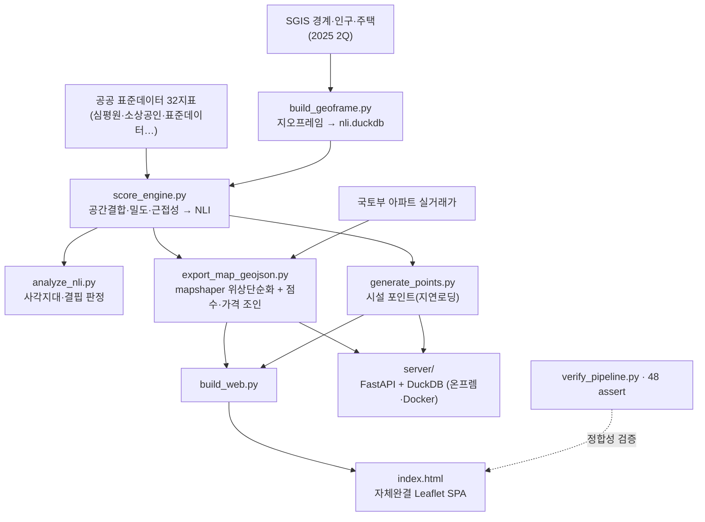

# 동네살기지수 (NLI · Neighborhood Livability Index)

공공데이터 표준데이터를 **읍면동(행정동) 단위**로 융합해 지역 생활여건을 9개 도메인으로 정량화한 지수 + 정적 웹 대시보드 + 온프렘 API.

[](https://lucestdail.github.io/nli/)

**▶ [라이브 대시보드](https://lucestdail.github.io/nli/)** · **[스크롤 소개(데모)](https://lucestdail.github.io/nli/demo.html)**

- **분석 단위**: 전국 행정동 3,559개 (SGIS 2025 2분기 경계) · 총인구 정합 51.8M
- **스택**: 순수 Python (pandas · DuckDB spatial · mapshaper) 데이터/지오 파이프라인 → 자체완결 단일 `index.html` (Leaflet SPA) + FastAPI 온프렘 패키지(`server/`)
- **빌드 프레임워크 없음**: 검증은 "스크립트 실행 + 실측 수치·상식 확인" (`verify_pipeline.py`, 48개 assert)

> 점수는 전국 읍면동 **상대평가(백분위) 참고용**입니다. 시설 밀도·근접 기반이라 도시성(인구밀도)을 일부 반영하므로, **동일 도농유형 내 상대비교**와 **지역 내부 사각지대 진단**에 활용을 권합니다(절대순위 맹신 X).

> **프로젝트 성격 (civic-tech · 포트폴리오).** 상용 서비스가 아니라, 흩어진 공공데이터를 **읍면동 단위로 통합·현행화**하고 결과를 **정직하게 검증·공개**한 1인 풀스택 프로토타입입니다. 유사 목적의 공공 분석(통계청 SGIS, 국토연구원 생활SOC/결핍지수 등)이 이미 존재하며, 본 프로젝트의 가치는 "새 지수의 발명"이 아니라 **통합·읍면동 해상도·정직한 한계 명시·즉시 쓰는 UX**에 있습니다. 데이터 엔지니어링·공간분석·풀스택·검증 역량의 데모로 봐주세요.

---

## 9개 도메인 · 32개 지표

| 도메인 | 지표 |
|---|---|
| D1 의료·건강 | 약국 · 의료기관 · 응급의료 |
| D2 교육·보육 | 초중등학교 · 학원(상가 세분) · 어린이집 · 도서관 |
| D3 생활편의·상업 | 생활편의 상가(음식·소매·수리·숙박) · 대규모점포 · 주유소 · 무료와이파이 |
| D4 문화·여가·체육 | 도시공원 · 여가 상가(예술·스포츠) · 체육시설 · 박물관·미술관 · 공연장 · 영화관 |
| D5 교통·이동 | 버스정류소 · 지하철역 · 주차장 · 자전거(보관소·대여소) |
| D6 안전 | CCTV · 어린이보호구역 · 안전비상벨 · 민방위대피 |
| D7 환경·기후 | 전기차충전소 · 무더위쉼터 · 보호수 |
| D8 복지·돌봄 | 사회복지시설(VWorld 지오코딩 약 96% 커버) · 경로당·마을회관 |
| D9 반려·동물 | 동물병원 |

*지역특성 축*: 인구밀도 · 인구 · 고령/유소년비중 · 아파트비율 · 노후주택비율(1999년 이전) · 아파트 실거래 평당가.

## 방법론 (스코어링)

지표별 **[밀도(인구 1만명당 · 면적 ㎢당 혼합) 백분위 + 근접성(최근접 m) 백분위]** → 도메인 가중평균 → NLI 도메인 가중합 → **S/A/B/C/D** 등급(10/25/30/25/10).

보정:
- **인구가중 중심점**: 상가 밀집 위치로 대체(큰 동의 산지 기하중심 왜곡 방지)
- **도농 코호트**: 행정동명(면/읍/동) + 인구밀도 기반 3분류(병행)
- **동일 유형 상대비교(`NLI_cohort`)**: 밀도가 다른 지역을 억지로 한 줄로 세우지 않도록, 같은 도농유형(도시/도농복합/농촌)끼리 백분위 제공 — 앱에서 "동일 유형 내 상위 %"로 표시
- 결측 재정규화 · MIN_POP=100 · 부정지표 `neg` 백분위 반전(훅 — 데이터 미편입)

**가중치**: 기본은 **균등**(OECD 복합지표 관행·투명성). 앱에서 페르소나(가구유형)와 객관가중 프리셋(정보량/엔트로피·CRITIC, `analysis/weight_analysis.py`)을 실시간 적용. *분산 ≠ 중요도* 한계 명시.

---

## 검증과 한계 (정직하게)

이 지수는 시설 **공급(밀도·근접)** 을 측정합니다. 만들면서 스스로 외부 지표와 대조한 결과 중요한 한계를 확인했고, 숨기지 않습니다 — **이 정직함이 프로젝트의 핵심**입니다.

**외부 상관 검증** (n≈3,050개 동, 아파트 실거래 ㎡당가 대비):

| 관계 | Pearson |
|---|---|
| NLI ↔ 아파트값 | +0.55 |
| NLI ↔ 인구밀도 | **+0.89** |
| NLI ↔ 아파트값 *(인구밀도 통제 편상관)* | **−0.10** |

NLI가 집값과 보이는 상관(+0.55)은 **거의 전부 인구밀도로 매개**됩니다. 밀도를 통제하면 설명력이 사라집니다 — 즉 **현재 지수는 "살기 좋음"보다 "도시성"을 상당 부분 측정**합니다.

**밀도 탈편향 실험**(집계식만 바꾼 7개 변형을 재계산·비교): 밀도 상관은 0.89 → 0.05까지 기계적으로 낮출 수 있지만, **어떤 변형도 집값 타당성을 회복하지 못했습니다**(밀도 통제 편상관 −0.10 고정). → 밀도 편향 제거는 "버그 수정"이 아니라 **가치 선택**입니다("도시 편의도" vs "인구당 충족도"). 하나의 숫자로 둘 다 만족시킬 수 없습니다.

**가중 민감도 검증**(대안 가중 13종 + 무작위 교란 500회): 균등 가중은 관행적 선택이지만 그 영향은 제한적입니다 — 페르소나·객관가중 프리셋과 무작위 교란 전체에서 균등 대비 **순위상관 0.98~1.00·등급변동 중앙 9%**로 **등급은 가중 선택에 강건**합니다. 반대로 NLI↔밀도 상관은 **모든 가중에서 0.86~0.90**으로, 어떻게 재가중해도 벗어나지 못합니다 → 밀도 편향은 가중이 아니라 **지표 구성에 내재**하며, 위의 코호트(동일 도농유형) 상대비교로만 대응됩니다.

**그래서 이렇게 씁니다**:
- **동일 유형(도농 코호트) 내 상대비교** — 도시는 도시끼리, 농촌은 농촌끼리 백분위. "그냥 도시임을 재는 것" 문제를 정면 해소(앱 "동일 유형 내 상위 %").
- **지역 내부 사각지대 진단**(인사이트 탭) — 절대순위가 아니라 지자체·읍면동 *내부*의 상대 격차라 밀도 편향에 강건. **가장 신뢰할 수 있는 사용처**.
- 전국 절대순위는 **"참고용"** 으로만.

**그 밖의 한계**: 개수·밀도 ≠ 용량·품질(병상·정원 등 용량 가중 없음) · 프록시 지표(안전=CCTV 개수 등) · 단일 시점(시계열 없음) · 균등 가중은 관행적 선택 · 부정지표(교통사고 등) 반전 로직은 훅만 구현(데이터 미편입).

---

## 아키텍처 (파이프라인)

설정 주도(`datasets.yml`) · 재현 가능 · 정적 웹과 온프렘 API가 같은 스냅샷을 공유.



- **한 방향 파이프라인** — 각 단계가 파일로 존재(`ingest.py`가 오케스트레이션). 중간 산출물은 gitignore, 배포엔 `index.html` 하나면 됨.
- **좌표계 주의** — 시설 좌표를 EPSG:5179로 재투영(축순서) 후 `ST_Contains`로 동 귀속(DuckDB spatial).
- **위상 보존 단순화** — mapshaper로 인접 동 공유경계 보존(흰 틈 방지).

## 파이프라인 재현

```bash
# 원본 데이터(gitignore) → 스냅샷 한 번에: score→analyze→export→points→web→cp→verify
./venv/bin/python pipeline/ingest.py

# (지오프레임까지 새로: 경계·인구·주택 변경 시)
./venv/bin/python pipeline/build_geoframe.py    # SGIS 경계+인구+주택 → nli.duckdb
./venv/bin/python pipeline/ingest.py

# 검증(총인구·조인·좌표·등급·세분·임베드 assert)
./venv/bin/python pipeline/verify_pipeline.py
open index.html
```

**데이터 추가법**: `data/datasets.yml`에 항목 하나 추가
`{key, name, domain, path, reader, lon, lat, [prox], [w], [neg], [export_points]}` → 자동 편입(코드 수정 없음).

디렉토리: `pipeline/`(코어) · `prep/`(가공) · `collect/`(API수집) · `analysis/`(가중치·통계) · `legacy/`(구 Selenium, 미사용). 원본·중간 산출물(`data/`, `*.duckdb`, `*.geojson`, `nli_points.json`)은 커밋하지 않음(`.gitignore`).

---

## 대시보드 (3탭 SPA)

**① 지도** — 지표별 백분위 색칠 · 사각지대/인구대비 모드 · 시설 포인트 11종(확대 시 토글: 약국·응급·어린이집·학교·도서관·공원·체육·주차·전기차·복지·경로당) · 동 클릭 상세(9도메인·시설개수·최근접·아파트 실거래·통근·**동일 유형 내 상위 %**) · 사이드바 페르소나·가중치 슬라이더.

**② 내 동네 찾기 (B2C)** — 가구유형(육아·1인·고령·반려)·예산·통근으로 **맞춤 Top10** · **가성비 동네**(살기지수÷아파트값) · 지역 순위 · 동 검색 → 상세 카드(전국/동일유형 상위 % 이중 표시) · 상세 모달 · "이 동네가 속한 지역 진단 보기" 연결.

**③ 인사이트 (지역 진단)** — **[동][시군구] 토글**로 개별 읍면동 또는 지자체 229곳 단위 **생활여건 진단**: 취약·강점 도메인·**사각지대**(인구 1만+ 인데 특정 도메인 전국 하위 20%) 자동판정 · **전국/동일 유형 취약순위** · **진단 리포트(PDF)**(동·시군구 각각 · 동 리포트는 시설 현황 포함) · 시군구 다중선택 → **통계 분석 모달**(레이더·상관 히트맵·회귀 산점도). 모바일=탭 시 진단 카드 모달.

**공유 딥링크** — 현재 상태(탭·선택동·가중치·지표·통근·비교)를 URL 해시에 인코딩:
```
index.html#v=find                 # 내 동네 찾기
index.html#v=insight              # 지자체 진단
index.html#d=노형동&m=D1&md=blind  # 노형동 상세 + 의료 사각지대 지도
index.html#c=역삼1동~노형동         # 지역 비교 패널
```

---

## 온프렘 API 패키지 (`server/`)

FastAPI + DuckDB. 스냅샷(정적 데이터) 읽기전용 서빙 + 추천·진단. `clone → docker compose up → API+데모`.

```bash
cd server && cp .env.example .env && docker compose up -d --build
curl localhost:8080/api/health        # {"status":"ok","dong":3559}
open localhost:8080/docs              # OpenAPI(Swagger) 자동
```

주요 엔드포인트: `/api/dong/{adm_cd}` · `/api/score?lat=&lon=` · `/api/rank` · `/api/recommend` · `/api/diag[/{sgg}]` · `/api/geojson` · `/api/points` · `/api/meta` · `/api/health`. 에러 `{error,message}` · CORS · IP 레이트리밋 · 선택 API키. 설치·운영은 [`server/README.md`](server/README.md) · [`server/DEPLOY.md`](server/DEPLOY.md).

---

## 재현 스크립트 (핵심)

```
build_geoframe.py     경계+인구+주택 지오프레임 → nli.duckdb
score_engine.py       스코어링 엔진 (datasets.yml 기반)
analyze_nli.py        사각지대·결핍·프로필 판정
export_map_geojson.py mapshaper 위상단순화 + 점수·실거래가 조인
generate_points.py    시설 포인트(지연로딩)
build_web.py          SPA(index.html) 생성
ingest.py             score→…→web→verify 오케스트레이션
verify_pipeline.py    파이프라인 정합성 검증기(48 assert)
analysis/weight_analysis.py  객관가중(엔트로피·CRITIC)
collect/*.py          data.go.kr API 수집 · VWorld 지오코딩
```

## 데이터 출처

공공데이터포털 표준데이터 · SGIS(통계지리정보) 경계·인구(2025 2Q) · 건강보험심사평가원 · 소상공인시장진흥공단 · 국토교통부 아파트 실거래가 · safetydata.go.kr · VWorld 지오코딩. 출처·시점은 **앱 하단 출처 표(모달)** 에서 자료별로 확인(온프렘 API는 `/api/meta`).

**라이브**: [lucestdail.github.io/nli](https://lucestdail.github.io/nli/)
